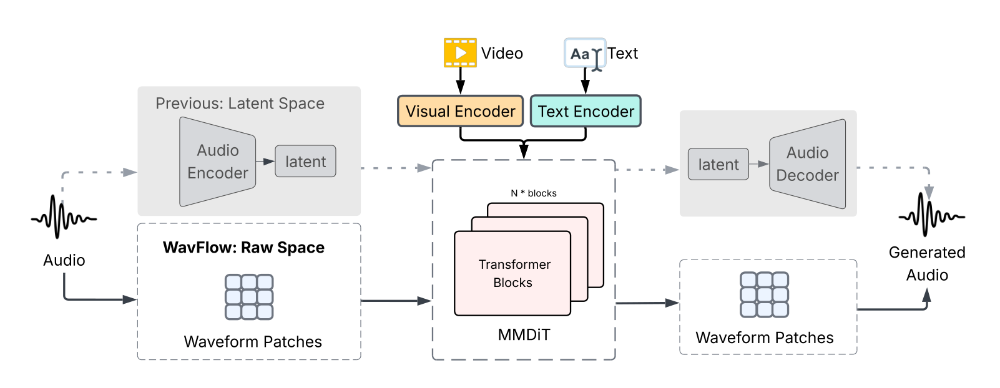
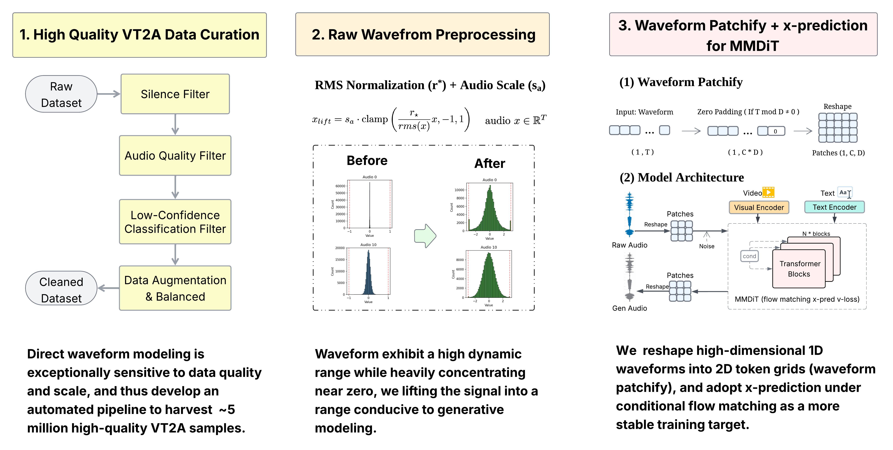

<div align="center">

# WavFlow: Flowing Through Waveforms for Audio Generation

[Feiyan Zhou](https://zhoufeiyn.github.io/)<sup>1,2</sup>,
[Luyuan Wang](https://www.luyuan.wang/)<sup>1</sup>,
[Shoufa Chen](https://www.shoufachen.com/)<sup>1</sup>,
[Zhe Wang](https://wangzheallen.github.io/)<sup>1</sup>,
[Zhiheng Liu](https://johanan528.github.io/)<sup>1</sup>,
[Yuren Cong](https://yrcong.github.io/)<sup>1</sup>,
[Xiaohui Zhang](https://www.linkedin.com/in/xiaohui-zhang-79569539)<sup>1</sup>,
[Fanny Yang](https://www.linkedin.com/in/fanny-yang-035861128)<sup>1</sup>,
[Belinda Zeng](https://www.linkedin.com/in/belindazeng)<sup>1</sup>

<sup>1</sup> Meta AI &nbsp;&nbsp; <sup>2</sup> Northeastern University

**[[Project Page]](https://facebookresearch.github.io/WavFlow/)** &nbsp; **[[arXiv]](#)** &nbsp;

</div>

## Overview

WavFlow generates synchronized, high-fidelity audio given video and/or text inputs **directly in the raw waveform space** (16 kHz / 44.1 kHz) — no VAE, no intermediate latent representations. By reshaping audio into 2D token grids (waveform patchifying) and applying amplitude lifting, WavFlow enables stable flow matching via direct *x*-prediction, achieving state-of-the-art results on **VGGSound** and **MovieGen-Audio**.

<p align="center">
  
</p>

## Demo Samples

A few synthesized clips across categories. Click play (audio is included). For all 24+ samples and side-by-side benchmark comparisons, see the **[Project Page](https://facebookresearch.github.io/WavFlow/)**.

<table>
<tr>
<td width="50%">

**🌳 Forest** *(natural)*

https://github.com/facebookresearch/WavFlow/raw/main/docs/videos/demo/0_natural_1_forest.mp4

</td>
<td width="50%">

**🐸 Frog** *(animal)*

https://github.com/facebookresearch/WavFlow/raw/main/docs/videos/demo/1_animal_1_frog.mp4

</td>
</tr>
<tr>
<td width="50%">

**🥁 Drum** *(music)*

https://github.com/facebookresearch/WavFlow/raw/main/docs/videos/demo/2_music_drum.mp4

</td>
<td width="50%">

**🛹 Skateboard** *(sport)*

https://github.com/facebookresearch/WavFlow/raw/main/docs/videos/demo/4_sport_skateboard.mp4

</td>
</tr>
</table>

## Method

<p align="center">
  
</p>

## Installation

```bash
git clone https://github.com/facebookresearch/WavFlow.git
cd WavFlow
bash scripts/setup.sh         # creates conda env 'wavflow' and installs everything
conda activate wavflow
```

<details>
<summary>Manual setup (if you'd rather drive conda yourself)</summary>

```bash
conda create -n wavflow python=3.10 -y
conda activate wavflow
pip install -r requirements.txt                          # pinned dependencies
pip install -e . --no-deps                               # install wavflow itself (editable)
conda install -n wavflow -c conda-forge "ffmpeg<7" -y    # required for torio video decoding
```

</details>

## External Weights

> **TL;DR — you don't need to download anything.** All required external weights (CLIP, Synchformer, the empty-string CFG embedding) are fetched or computed on the fly the first time WavFlow runs, and cached under `~/.cache/wavflow/`.

<details>
<summary>Details (offline use, custom cache, etc.)</summary>

| Artifact | How it is obtained on first use | Override field |
|---|---|---|
| DFN5B-CLIP-ViT-H-14-384 | downloaded by `open_clip` from HuggingFace ([Download](https://huggingface.co/apple/DFN5B-CLIP-ViT-H-14-384)) | `model.clip_pretrained` |
| `synchformer_state_dict.pth` | direct URL ([Download](https://github.com/hkchengrex/MMAudio/releases/download/v0.1/synchformer_state_dict.pth)) | `model.synchformer_ckpt` |
| `empty_string.pth` | computed locally with CLIP on first **training** run; for inference it's restored from the trained checkpoint and not needed at all | `model.empty_string_ckpt` |

</details>

## Inference

To try it out, run:

```bash
bash scripts/launch/predict.sh [--gpu N] [--config PATH] [--help]
```

### Options

| Flag / env | Default | Description |
|---|---|---|
| `--gpu N` *(or `GPU=N`)* | `0` | CUDA device index |
| `--config PATH` *(or `CONFIG_PATH=...`)* | `wavflow/configs/infer.yaml` | YAML config to load |
| *(default `model.name` in that config)* | `medium_16k` | Model variant — one of `medium_16k`, `medium_44k`, `large_16k`, `large_44k` |
| `WAVFLOW_ENV` | `wavflow` | conda env name to auto-activate |

Any extra positional argument is forwarded to `python -m wavflow.infer`.

### Input CSV

`wavflow/configs/infer.yaml` → `data.csv_path` (default: `training_samples/infer_example.csv`):

```csv
video_path,caption,video_exist,text_exist
/abs/path/to/sample1.mp4,a whistling rocket explodes,1,1   # video + text example
/abs/path/to/sample2.mp4,birds chirping in a forest,1,1    # video + text example
,a whistling rocket explodes,0,1                           # text-only example
/abs/path/to/sample3.mp4,,1,0                              # video-only example
```

- `video_exist=0` → uses learned empty CLIP/Sync tokens (no video decode).
- `text_exist=0` → uses learned empty CLIP-text token (caption ignored).
- Optional `id` column. If absent, the wav file name is derived from `Path(video_path).stem`, falling back to `row_<idx>` for text-only rows.
- Captions with commas must be quoted.

### Key fields in `infer.yaml`

| Field | What to set |
|---|---|
| `data.csv_path` | the input CSV above |
| `model.name` | one of `medium_16k`, `medium_44k`, `large_16k`, `large_44k` (must match the trained ckpt) |
| `model.ckpt_path` | a `checkpoint_*.pth` (full training ckpt) or `ema_epoch_*.pth` (EMA-only) |
| `model.use_ema` | `true` to load `model_ema1` from a full ckpt; `false` to load the live `model` weights |
| `inference.duration_sec` | window length decoded from the video and length of the output wav (default 8 s, must match model arch) |
| `inference.target_sample_rate` | output wav SR, must match the `_16k` / `_44k` model suffix |
| `inference.cfg`, `num_steps`, `noise_scale`, `noise_shift`, `prediction_type`, `seed` | sampling hyperparameters |
| `inference.batch_size` | rows generated per ODE batch |
| `inference.trim_to_duration` | if `true`, output wav is trimmed to `inference.duration_sec` |
| `output.output_dir` | where wavs are written |
| `output.loudness_norm`, `loudness_target_lufs` | optional `pyloudnorm` post-processing |

### Examples

```bash
# Default config, GPU 0
bash scripts/launch/predict.sh

# Use GPU 1 with a custom infer config
GPU=1 bash scripts/launch/predict.sh --config wavflow/configs/my_infer.yaml
```

### EMA caveat

The EMA checkpoint stored as `model_ema1` inside a full training ckpt is updated with `ema_decay = 0.9999` per step. After only a few hundred / thousand steps the EMA tensor still contains random-init values and will produce noise during inference. Set `model.use_ema: false` (or pass an `ema_epoch_*.pth` saved after enough steps) when sampling from a short / overfit run.

## Training

For feature extraction and training (single-node and multi-node), see the dedicated guide:

**[→ TRAINING.md](TRAINING.md)**

## TODO

- [ ] Release some of the WavFlow model weights.

## Citation

```bibtex
@article{zhou2026wavflow,
  title   = {WavFlow: Flowing Through Waveforms for Audio Generation},
  author  = {Zhou, Feiyan and Wang, Luyuan and Chen, Shoufa and Wang, Zhe and
             Liu, Zhiheng and Cong, Yuren and Zhang, Xiaohui and Yang, Fanny and Zeng, Belinda},
  journal = {arXiv preprint},
  year    = {2026},
}
```

## Acknowledgements

<div align="center">

**We extend our heartfelt gratitude to the open-source community!**

</div>

<table align="center">
<tr>
<td align="center" width="33%">

🎵 **[MMAudio](https://github.com/hkchengrex/MMAudio)**
*Multimodal audio generation*

</td>
<td align="center" width="33%">

🚀 **[JiT](https://github.com/LTH14/JiT)**
*Just-in-Time Diffusion*

</td>
<td align="center" width="33%">

🔗 **[Synchformer](https://github.com/v-iashin/Synchformer)**
*Audio-Visual Synchronization*

</td>
</tr>
</table>

<div align="center">

🌟 *Special thanks to all researchers and developers who contribute to the advancement of AI-generated audio and multimodal learning!*

</div>

## License

WavFlow is released under the Apache 2.0 license. See [`LICENSE`](LICENSE) for details.
